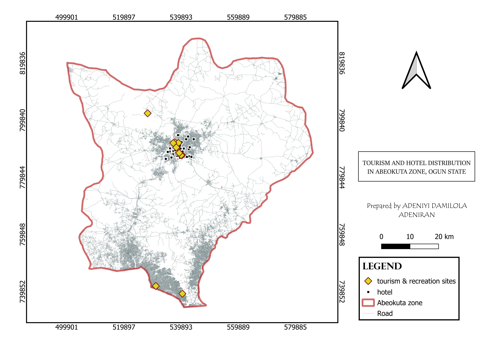
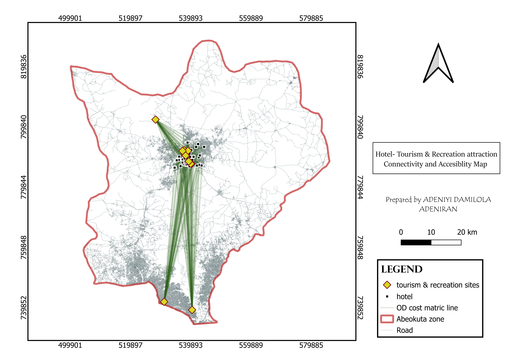
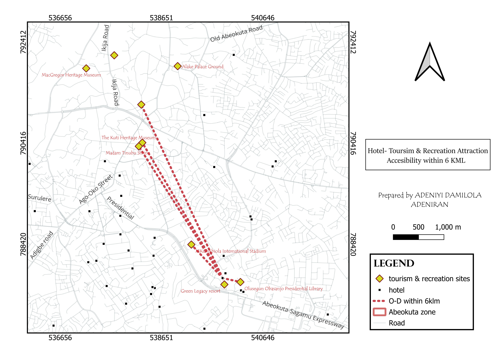

# Month 1 Summary — Tourism & Recreation Accessibility in Abeokuta

## Question

**Which hotel provides better access to multiple tourist attractions while minimising travel distance within the study area?**

> The broader goal is to develop a geospatial approach that can support tourism trip planning by helping visitors understand **where to stay, which attractions are nearby, how to get there, and what other attractions they can visit within the same trip.**

## Operation

Collected and prepared spatial data for hotels, tourist centres/attractions, and the road network within the study area.

In QGIS, I prepared the datasets and used the **QNEAT3 Origin-Destination Cost Matrix** to calculate network travel distances between:

- **Hotels as origins**
- **Tourist centres/attractions as destinations**
- **Road network as the movement network**

> I then filtered the OD results using a **6 km travel-distance threshold** to identify tourist attractions that could be accessed within the selected distance from each hotel.

### Expected

> I expected hotels located around the major tourism cluster in Abeokuta, particularly around the **Olusegun Obasanjo Presidential Library (OOPL)** and central Abeokuta, to have better accessibility to multiple tourist attractions because of their proximity to several destinations and the surrounding road network.

### Got

The network analysis produced multiple hotel-to-tourist-attraction connections.

After applying the **6 km network-distance threshold**, **Green Legacy Villa around OOPL** emerged as having connections to several of the selected tourist attractions, including:

- *Olumo Rock Tourist Centre*
- *MacGregor Heritage Museum*
- *Alake Palace Ground*
- *Itoko Adire Market*
- *The Kuti Heritage Museum*
- *Madam Tinubu Shrine*
- *MKO Abiola International Stadium*

This showed how network analysis can reveal relationships that are not immediately obvious from simply looking at the locations on a map.

## What surprised me

What stood out to me was that **being geographically close does not necessarily tell the complete story about accessibility**.

> Two attractions may appear relatively close on a map, but the actual distance through the road network can be different. The OD Cost Matrix therefore provided a more practical way of looking at tourism accessibility than simply measuring straight-line distance.
> I also found it interesting that one accommodation location could provide access to several attractions within the same travel-distance threshold.

## Maps Generated
> The image below shows the distribution of hotel, tourism & recreation attraction sites

> The image below shows hotel, tourist and recreation attraction site connectivity using < OD-cost matrix >

> The image below shows most connected hotel to tourism and recreation site, while maximizing distance of 6kml

## Limitations, stated plainly

- The analysis uses **travel distance**, but does not yet account for actual travel time, traffic congestion, or different travel conditions.
- The **6 km threshold is a fixed value** and does not necessarily represent every tourist's preferred travel distance.
- The analysis does not yet consider hotel price, quality, availability, or visitor preferences.
- The result depends on the **quality and completeness of the road network and tourism datasets**.
- Accessibility was examined primarily from the perspective of distance; other factors such as public transport availability and road condition were not included.
  
## What I still need

-i **Travel-time data** to move beyond distance and understand how long it actually takes to reach each attraction.
-ii More detailed **hotel attributes**, such as price, rating, availability, and accommodation capacity.
-iii More complete **tourist-attraction information**, including opening hours, entrance fees, and attraction categories.

## Month 1 Reflection

Month 1 has taken me from **defining a real-world tourism problem to applying network analysis to understand accessibility**.

I started with the question of how GIS could help someone plan a tourism trip. By the end of the month, I was using QGIS and QNEAT3 to move from simply asking **"Where are the attractions?"** to asking **"How accessible are these attractions from where a visitor stays?"**

There is still a lot to improve, but this month has shown me how geospatial data can move beyond maps and become a tool for **decision-making and real-world problem solving**.

